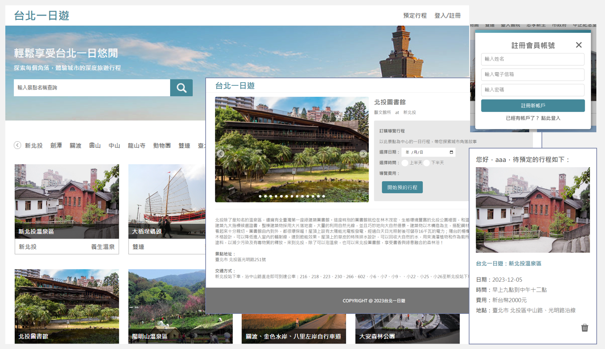
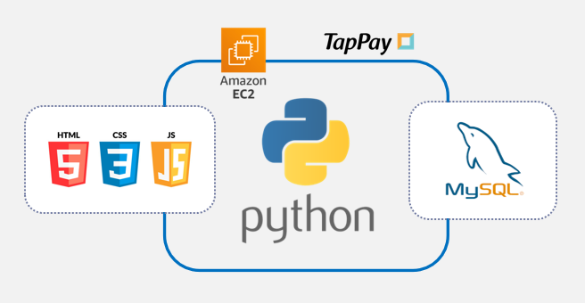
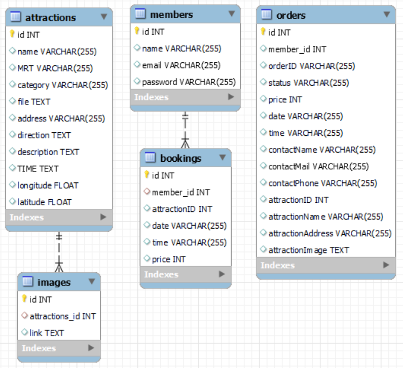

## 台北一日遊

提供台北景點資訊查詢、行程訂購的旅遊電商網站。  

## Architecture

依照 RESTful API 的原則，建構 前後端分離 的 網站架構。  
由 JavaScript 處理前端頁面，完成 RWD、滾動載入、關鍵字搜尋、圖片輪播、會員系統、行程預定等項目。  
由 Python 架構後端伺服器，運用 MySQL 做資料管理，結合 TapPay 處理付款金流，使用 Amazon EC2 部屬上線。

## Database

